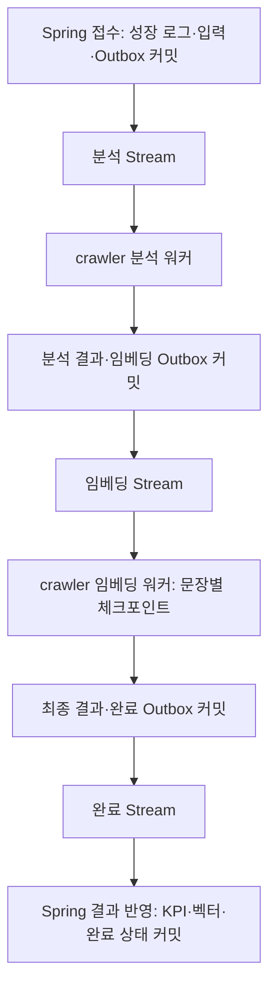

# 성장 로그 Redis Stream 파이프라인 v2

## 문제와 변경

기존 성장 로그 워커는 Spring에서 Redis 메시지를 소비한 뒤 crawler의 HTTP 분석 응답을 기다렸다. crawler는 LLM 응답 파싱 중 역량별 임베딩을 호출해, 임베딩 실패가 분석 전체 요청 실패로 전파됐다.

v2는 crawler가 분석·임베딩 Stream을 직접 소비한다. Spring이 접수 시점 입력과 작업, Outbox를 PostgreSQL의 작업 전용 테이블에 함께 저장한다. Stream에는 schemaVersion, eventId, jobId, stage만 전달한다. 긴 입력·분석 결과·벡터는 작업 테이블에 보관하며 crawler에는 이 테이블에 필요한 권한만 부여한다. 두 서비스가 작업 스키마에 의존하는 비용을 감수하고, 입력 조회·결과 반환용 HTTP 호출은 제거했다.



범위는 **성장 로그**다. 포트폴리오/FastAPI 전환은 이 PR에 포함하지 않는다. 기존 sync/async 모드는 유지하고 stream 모드를 별도로 추가한다. Spring의 기존 처리 토큰·조건부 업데이트를 유지하면서 분산 결과 반영 경계에 적용한다.

## 저장·전달 계약

- 기준 스키마: Spring `src/main/resources/db/growth-pipeline.sql`. crawler 테스트 fixture는 같은 파일의 사본이다. 기존 운영 테이블을 삭제하는 SQL은 없다.
- `growth_analysis_job`: 입력 스냅샷, 처리 토큰, 분석 결과, 임베딩 체크포인트·모델, 현재 단계·상태, 시도 수, lease, 완료 시각.
- `growth_analysis_outbox`: 안정적인 eventId, jobId, 다음 단계, 발행 가능 시각, 발행 완료 시각.
- 단계: ANALYZE → EMBED → APPLY. 상태: READY / RUNNING / COMPLETED / FAILED / SUPERSEDED.
- `processing_token`은 해당 성장 로그의 요청 버전이다. 별도 `lease_token`은 단계 실행 권한이며 만료된 실행은 체크포인트·결과를 커밋할 수 없다.
- Stream/그룹: `{growth-v2}:analyze` / `growth-analysis-v2`, `{growth-v2}:embed` / `growth-embedding-v2`, `{growth-v2}:results` / `growth-results-v2`.
- 각 Stream은 전용 그룹 하나만 사용한다. ACK와 XDEL을 Lua로 함께 수행하므로 다른 독립 그룹을 추가하면 안 된다. 감사·관측은 DB·로그를 사용한다.
- 그룹을 처음 만들 때 `0-0`과 MKSTREAM을 사용하여 그룹 생성 전 메시지를 건너뛰지 않는다.
- 스키마가 맞지 않는 메시지는 원문 없이 출처 Stream·레코드 ID·오류 종류를 DLQ에 보존하고 제거한다.

## 트랜잭션과 실패

1. 접수: 성장 로그·입력 스냅샷·Outbox가 함께 커밋된다. PostgreSQL advisory transaction lock과 미완료 job 수로 접수를 제한한다. 초과 시 503이며 전체 접수 트랜잭션이 롤백된다.
2. 발행: Outbox 행을 SKIP LOCKED로 선점하고 XADD 후 발행 시각을 기록한다. XADD 후 DB 커밋 전에 종료하면 같은 eventId가 재발행될 수 있다.
3. 분석·임베딩: 짧은 DB 트랜잭션으로 lease를 얻은 뒤 외부 호출을 수행한다. 결과·다음 Outbox를 함께 커밋한 뒤 현재 메시지를 ACK한다.
4. 임베딩: 분석 결과와 완료된 문장별 벡터를 재사용한다. 임베딩 모델이 변경되면 기존 체크포인트와 섞지 않고 실패로 남긴다. 배치 호출은 아직 적용하지 않았다. 현재는 문장별 복구 단위를 우선했다.
5. Spring 반영: job 행 잠금, 최신 처리 토큰 검증, 기존 조건부 apply 선점, KPI·임베딩·완료 상태를 같은 트랜잭션으로 반영한다. 별도 REQUIRES_NEW로 저장하는 기존 best-effort API 대신 새 원자적 임베딩 저장 경로를 사용한다.
6. 일시 실패: nextAttemptAt과 지연 Outbox를 기록하고 현재 메시지를 ACK한다. 기본 3회, 지수 backoff·jitter 적용. HTTP 오류에 Retry-After가 노출되면 그보다 빨리 재시도하지 않는다. 입력·출력 형식 오류와 영구 HTTP 4xx는 즉시 실패 처리한다.
7. 워커 종료: Pending을 회수하지만 DB lease를 얻은 실행만 처리한다. lease는 90초, heartbeat는 10초, Redis claim 기준은 120초다. 기본 300초 이후 heartbeat 갱신을 중단하고 늦은 완료 결과를 거절한다. 외부 라이브러리가 멈춘 호출을 강제로 종료하는 기능은 없으므로 공급자·도구 HTTP timeout 설정과 실제 장시간 작업 실험이 필요하다.
8. 발행한 Redis 알림이 사라진 경우: 5분 이상 진행이 없고 미발행 Outbox·최근 발행 이벤트가 없는 미완료 job을 재발행한다. SQL 데이터 자체의 손실은 DB 백업·복구 영역이다.

## 부하와 관측

- 워커는 실행 스레드당 1개씩 읽어 로컬 숨은 대기열을 만들지 않는다. 분석·임베딩 기본 동시 실행 수는 각각 2다.
- Redis의 단계별 전역 예산은 기본 **작업 시작 30회/분**이다. 여러 인스턴스가 공유한다. 이것은 LLM tool-call 각각의 HTTP 요청·토큰 예산이나 임베딩 문장별 호출 한도와 같지 않다. 실제 provider RPM/TPM 제한은 후속 검증·확장 대상이다.
- Spring 기본 미완료 job 접수 상한은 1,000이다. 실측 처리량·대기시간에 맞게 조정한다.
- `GET /v1/growth-logs/{growthLogId}/analysis-status`: 인증된 소유자만 최신 job의 단계·상태·시도 수·오류 코드·시각을 조회한다. 입력·벡터·토큰은 응답하지 않는다.
- Micrometer: `growth.pipeline.active.jobs`, `growth.pipeline.outbox.pending`, `growth.pipeline.oldest.job.seconds`, `growth.pipeline.failed.jobs`. jobId는 로그에 남기고 고카디널리티 메트릭 label로 사용하지 않는다.
- 단계 로그: jobId, stage, attempt, committed, elapsedMs. LLM 응답 원문·벡터는 새 파이프라인 로그에 남기지 않는다. 기존 AI logger 설정도 운영에서 검토해야 한다.
- 기본 30일 보관: 완료 job 중 미발행 Outbox가 없는 데이터만 정리한다. 활성 작업의 Stream을 MAXLEN으로 무작정 자르지 않는다. 완료한 메시지는 ACK/XDEL하며 DLQ만 기간 기준으로 정리한다.

## 배포와 롤백

1. 운영 적용 전에 리뷰된 `growth-pipeline.sql`을 별도 마이그레이션 절차로 적용한다. 앱이 자동으로 운영 스키마를 변경하지 않는다.
2. crawler에 작업 테이블 SELECT/UPDATE 및 Outbox INSERT 권한만 가진 DB 계정을 제공한다. Spring은 자신의 업무 DB와 같은 DataSource/트랜잭션에서 작업 테이블에 접근한다. SQL 작업 테이블은 두 서비스에서 같은 물리 DB를 가리켜야 한다. 운영 접속은 TLS와 네트워크 접근 제한을 적용한다.
3. Redis 6.2 이상 명령이 필요하며 검증 기준은 Redis 7.4다. 작업 Redis에는 eviction으로 알림이 사라지지 않도록 설정하고, AOF·복제·백업 정책을 확인한다. SQL 기반 재조정이 있어도 복구 지연이 사라지는 것은 아니다.
4. 먼저 Spring의 `GROWTH_PIPELINE_ENABLED=true`로 relay/result 처리를 켜고 요청 모드는 기존 async로 유지한다. crawler의 설정도 준비하고 활성화한다.
5. 기존 `growthlog:evaluate` 작업을 drain한 뒤 Spring의 `GROWTH_LOG_EVALUATION_MODE=stream`으로 새 접수를 전환한다. 구형·신형 소비자가 같은 Stream을 공유하지 않는다.
6. 롤백은 접수 모드만 async로 돌리고 **GROWTH_PIPELINE_ENABLED는 두 서버 모두 true로 유지**해 이미 접수된 v2 작업을 완료한다. v2 미완료 job과 Outbox가 모두 비어야 소비자·relay를 끈다. 미완료 데이터를 삭제해서 롤백하지 않는다.
7. 이 변경은 자동 배포·merge하지 않는다. 두 저장소의 대응 PR을 함께 검토하고 기능 플래그를 켠다.

Spring 설정:
```text
GROWTH_PIPELINE_ENABLED=true
GROWTH_LOG_EVALUATION_MODE=stream
GROWTH_PIPELINE_MAX_OUTSTANDING=1000
GROWTH_PIPELINE_RETENTION_DAYS=30
```

crawler 설정:
```text
GROWTH_PIPELINE_ENABLED=true
GROWTH_PIPELINE_JDBC_URL=jdbc:postgresql://TASK_DB_HOST:5432/DB_NAME
GROWTH_PIPELINE_DB_USER=TASK_ROLE
GROWTH_PIPELINE_DB_PASSWORD=<secret manager value>
GROWTH_ANALYSIS_CONCURRENCY=2
GROWTH_EMBEDDING_CONCURRENCY=2
GROWTH_PIPELINE_MAX_ATTEMPTS=3
GROWTH_PIPELINE_STARTS_PER_MINUTE=30
GROWTH_PIPELINE_MAX_RUNTIME_SECONDS=300
```

## DLQ 재처리

DLQ에는 jobId와 stage가 있다. 입력·결과와 오류 코드는 작업 테이블에서 조회한다. 원인 수정 후 동일 입력의 복구인지 새 입력의 재분석인지 결정한다.

- 일반 사용자의 retry API는 새 처리 토큰과 입력 스냅샷으로 새 job을 만든다. 이전 job 결과가 새 요청을 덮어쓰지 않는다.
- 동일 입력의 단계 재개는 운영자 작업이다. 하나의 트랜잭션에서 job과 성장 로그를 잠그고, FAILED이면서 처리 토큰이 여전히 일치하는지 확인한 뒤 성장 로그를 PENDING, job을 READY·attempt=0·finished_at=NULL로 변경하고 해당 단계 Outbox를 추가한다. analysis/result 체크포인트는 보존한다. 다른 요청이 이미 시작됐거나 토큰이 다르면 재개하지 않는다.
- 임베딩 모델이 달라졌다면 기존 벡터를 섞지 않는다. 새 작업으로 명시적으로 재분석하거나 모델 일치 상태에서 재개한다.
- 단계 재개 전용 관리자 API·CLI는 이 PR에 포함하지 않는다. 직접 운영 변경 전 행 잠금·조건·영향 건수를 리뷰해야 한다.

## 검증과 기록

테스트는 실제 LLM 과금 호출을 하지 않는다. 외부 분석·임베딩만 모의하고, DB 테스트에는 실제 PostgreSQL을, Stream 테스트에는 실제 Redis를 연결할 수 있다. 환경변수가 없으면 저장소 테스트 일부는 H2로 실행되고 외부 서비스 테스트는 명시적으로 skip된다.

```powershell
$env:PIPELINE_TEST_JDBC_URL='jdbc:postgresql://127.0.0.1:55439/postgres'
$env:PIPELINE_TEST_REDIS_PORT='56379'
# 테스트 DB 역할은 pipeline_test, 비밀번호 없는 격리된 테스트 환경만 사용
```

Spring:
```text
./gradlew test --tests 'navik.domain.growthLog.*' --tests 'navik.pipeline.*'
```

crawler:
```text
./gradlew test --tests 'navik.growth.pipeline.*' --tests 'navik.pipeline.*'
```

`.github/workflows/growth-pipeline.yml`은 별도 PostgreSQL·Redis 서비스로 위 검증을 수행하고 JUnit XML·HTML 결과를 아티팩트로 저장한다. 테스트는 매 실행마다 고유 DB 스키마와 테스트 Stream을 만든다. 테스트 DB는 운영 DB와 반드시 분리한다.

아직 확인하지 않은 항목: 실제 공급자 RPM/TPM 제한, 운영 규모 부하에 따른 p95 개선율, 전체 Spring JPA 도메인과 실제 LLM을 묶은 배포 환경 E2E, 포트폴리오 전환, 프로세스 강제 종료·네트워크 분할의 반복 부하 실험. 성공한 시나리오를 시스템 전체 exactly-once나 무손실 보장으로 확대 해석하지 않는다.

## 코드 공유 경계

두 저장소의 `navik.pipeline.PipelineStreamConsumer`는 동일 wire 계약을 사용하는 작은 공통 소비 루프의 사본이다. 현재 독립 저장소 빌드·배포를 유지하기 위한 선택이다. 양쪽 Redis 드라이버를 각각 실제 Redis로 테스트하며, 수정 시 두 파일을 함께 갱신한다. 장기적으로 공통 라이브러리 배포 또는 계약 테스트 패키지로 추출할 수 있다.
